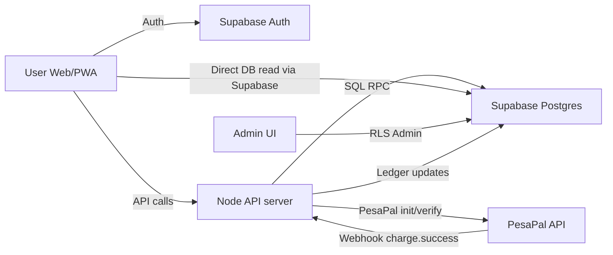
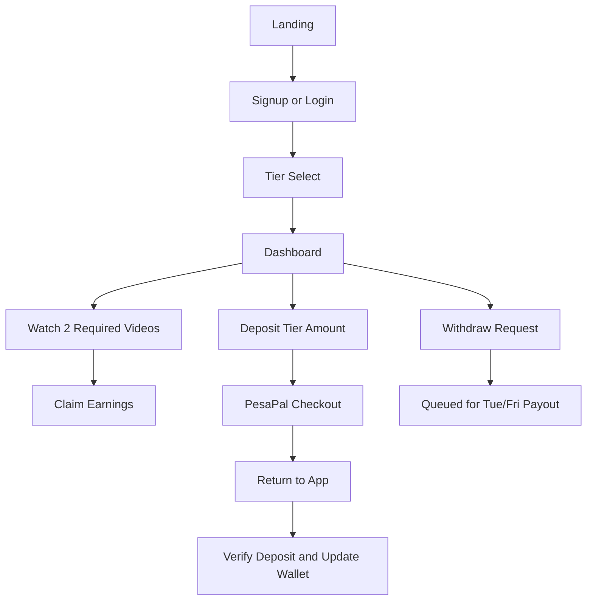
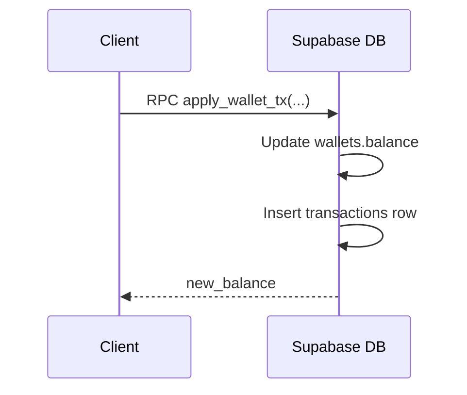
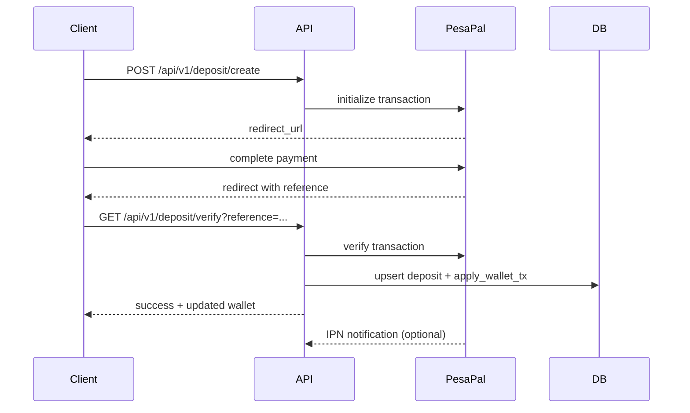
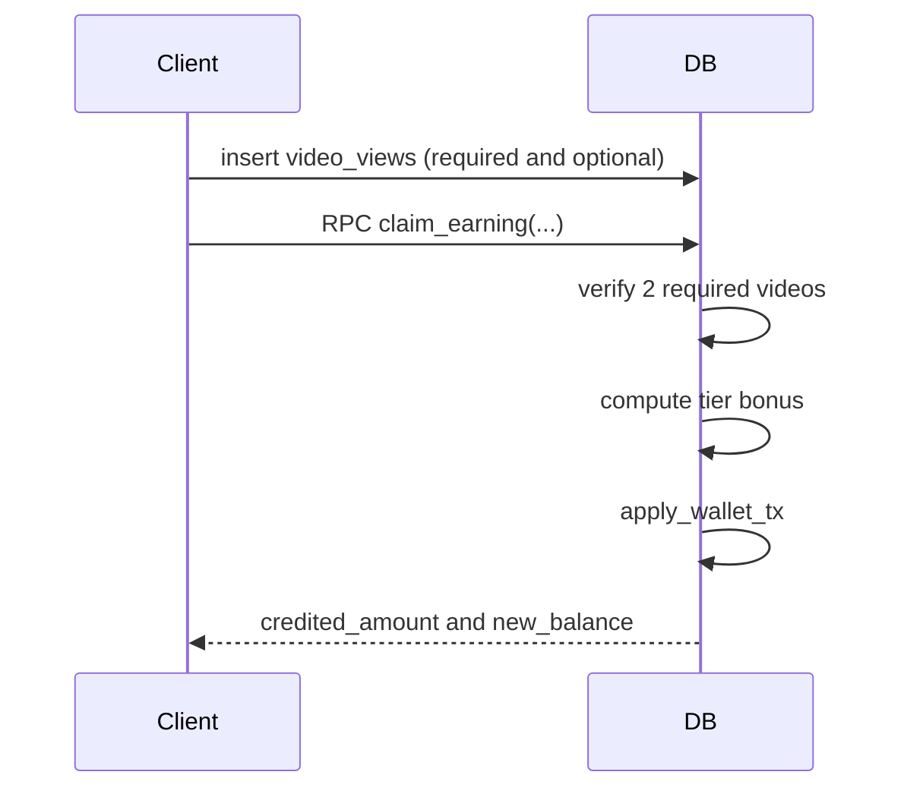
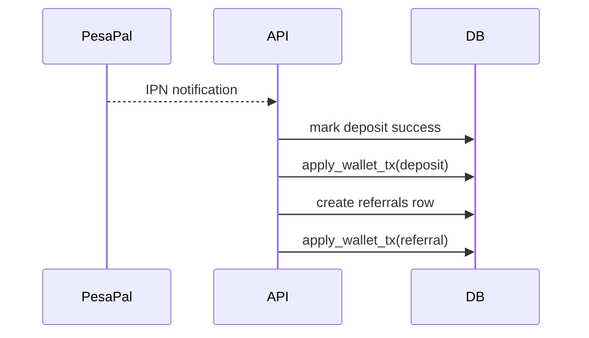
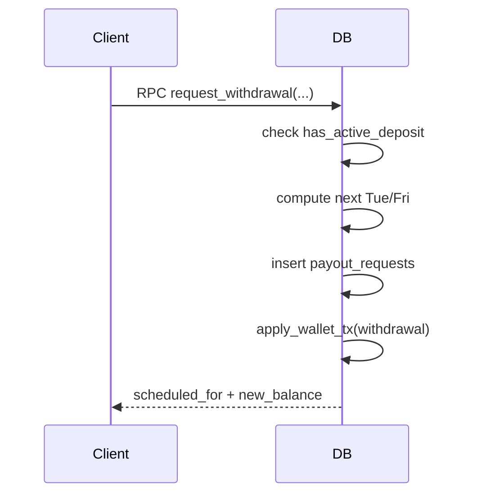
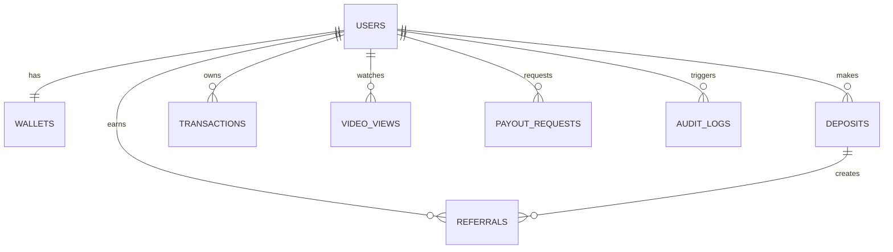

# EDDISON FLOW
Comprehensive system report for EdisonPay MVP.

Document version: 2026-03-20
Scope: Product logic, database, backend, frontend UX, payments, security, scaling, and operations.
Source of truth: Current repository implementation and Supabase migrations.

---

**1. Executive Summary**

EdisonPay is a web and mobile-first app that rewards users for completing daily video tasks within a tiered deposit model. Users sign up (email or Google), choose a tier, complete two required videos each day, and earn tier-based rewards. Tier deposits unlock withdrawals and can also be used to gate earnings depending on the deployed database migration. Deposits are processed through PesaPal in test mode, with wallet balances and a full ledger stored in Supabase Postgres. The system supports referrals with a 10 percent commission on the referred user's first successful deposit and includes an admin dashboard for payout review and reconciliation.

Core commitments:
1. Wallet math is authoritative and ledger-backed.
2. Earnings are idempotent and tied to verified video completions.
3. Deposits are idempotent and reconcile with PesaPal.
4. Withdrawals are scheduled Tue and Fri only.
5. Auth and access control are enforced by Supabase RLS policies.

---

**2. System Architecture (High Level)**

Mermaid diagram:

Components:
1. Frontend: `EdisonPayV4.jsx` single-page app with landing, auth, tier selection, dashboard, and admin UI.
2. Backend: `server/index.js` for deposit creation and verification, `server/pesapal-webhook.js` for webhook processing.
3. Data: Supabase Postgres (migrations in `supabase/migrations`).
4. Auth: Supabase Auth (email and Google OAuth).

---

**3. User Journey (End-to-End Flow)**

Mermaid diagram:

Key behavior:
1. New users are created in Supabase Auth.
2. `handle_new_user` trigger inserts a `users` row and wallet.
3. Tier selection sets `users.tier` and `profile_data.tier_selected = true`.
4. Earnings require 2 required video views. Optional bonus is tier-specific.
5. Withdrawals require deposit for the current tier.

---

**4. Tier Rules and Earnings Logic**

Tiers are defined in the frontend and enforced by `claim_earning`.

| Tier | Name | Deposit (KES) | Required Videos | Optional Videos | Daily Total |
| --- | --- | --- | --- | --- | --- |
| 1 | Regular | 5,000 | 2 | No | 100 |
| 2 | Standard | 10,000 | 2 | Yes | 125 |
| 3 | Deluxe | 20,000 | 2 | Auto | 375 |
| 4 | Executive | 50,000 | 2 | Auto | 1,125 |
| 5 | Executive Pro | 100,000 | 2 | Auto | 2,375 |

Rule details:
1. Each required video is worth 50 KES, with exactly 2 required videos per day.
2. Tier 2 has a small optional bonus (25 KES) if an optional video is completed.
3. Tiers 3-5 grant an automatic bonus to reach the daily total.
4. `claim_earning` uses Nairobi time (Africa/Nairobi) for day boundaries.

Idempotency:
1. Each claim uses `reference` keys like `claim:req:<user>:<day>`.
2. The function returns zero if already claimed for that day.

---

**5. Wallet and Ledger Model**

The wallet is authoritative and updated only via the ledger function `apply_wallet_tx`.

Wallet invariants:
1. `wallets.balance` is the authoritative number.
2. Every balance change creates a row in `transactions`.
3. `transactions.reference` ensures idempotency across retries.

Mermaid diagram:

---

**6. Deposit Flow (PesaPal)**

Two supported settlement paths:
1. Webhook path: PesaPal sends an IPN notification to the webhook.
2. Return path: client calls `deposit/verify` after PesaPal redirect.

Mermaid diagram:

Idempotency points:
1. `deposits.provider_reference` is unique.
2. `transactions.reference` for deposits is `dep:<reference>`.
3. Referral credit uses `ref:<reference>`.

---

**7. Earnings Flow (Video + Claim)**

Mermaid diagram:

Important behaviors:
1. Each video view is stored in `video_views`.
2. `video_views.watched_day` is computed in Nairobi time.
3. Claiming requires 2 required views for that day.
4. Optional views only affect Tier 2 bonus claim.

---

**8. Referral Flow**

Rules:
1. Single-level commission: 10 percent on the referred user's first successful direct deposit only.
2. Referral credit is processed when that first qualifying referred-user deposit succeeds.
3. Referral credit writes into `referrals` and a ledger `transactions` row.

Mermaid diagram:

---

**9. Withdrawal Flow**

Withdrawal scheduling logic:
1. Users can request any day.
2. Payouts are processed on Tue and Fri.
3. If requested on another day, the system schedules the next Tue/Fri.
4. Withdrawals are gated by successful tier deposit.

Mermaid diagram:

---

**10. Database Schema (Key Tables)**

Tables:
1. `users` (app profile): tier, referral_code, status, profile_data.
2. `wallets`: balance, available_for_withdrawal, hold.
3. `transactions`: ledger for every balance move.
4. `deposits`: PesaPal references and status.
5. `video_views`: required and optional watches.
6. `referrals`: commission tracking.
7. `payout_requests`: withdrawal queue.
8. `audit_logs`: admin and system actions.

Mermaid ER diagram:

---

**11. Supabase Auth and RLS**

Auth:
1. Email/password and Google OAuth are enabled.
2. `handle_new_user` creates a matching `users` row and `wallets` row.

RLS policy highlights:
1. Users can read their own `users`, `wallets`, `transactions`, `deposits`, and `video_views`.
2. Admin role is determined by `users.profile_data.role = 'admin'`.
3. Payout updates require admin privileges.

---

**12. Backend API (Node/Express)**

Endpoints:
1. `POST /api/v1/deposit/create`: initializes PesaPal checkout and stores pending deposit.
2. `GET /api/v1/deposit/status`: read deposit status by reference.
3. `GET /api/v1/deposit/verify`: verify PesaPal transaction and update wallet immediately.
4. `POST /api/v1/webhook/pesapal`: webhook handler for PesaPal events.
5. `GET /health`: health check.

Behavior summary:
1. `deposit/create` uses metadata to attach user_id and tier.
2. `deposit/verify` is the return-path that updates balances on success.
3. Webhook path is idempotent and safe to retry.

---

**13. Frontend UX and Routing**

Primary page states:
1. Landing: marketing and tier preview.
2. Login/Signup: email and Google OAuth.
3. Tier select: choose a tier after authentication.
4. Dashboard: user dashboard for earnings, deposits, referrals, withdrawals.
5. Admin dashboard: if role is admin.

Routing logic:
1. If not authenticated, the app stays on landing or auth.
2. If authenticated and tier not selected, the app forces tier selection.
3. If authenticated and tier selected, the user is routed to the dashboard.
4. Admin users are routed to admin dashboard.

---

**14. Admin Dashboard**

Capabilities:
1. View pending withdrawals.
2. Approve or reject withdrawals.
3. Inspect users and tiers.
4. Track referral activity.

Future-ready:
1. Add reconciliation panel for PesaPal vs internal ledger.
2. Add payout automation or integration with M-PESA.

---

**15. Security and Fraud Controls**

Current controls:
1. Supabase RLS for all tables.
2. Wallet updates only via `apply_wallet_tx`.
3. `claim_earning` is idempotent and checks daily limits.
4. `video_views` unique constraints prevent double credit per day.

Recommended additions:
1. Rate limiting for `claim_earning` calls.
2. Device attestation for video verification.
3. Admin review for large withdrawals.

---

**16. Scaling and Performance**

Scale targets:
1. Tables indexed on user_id, created_at for fast lookups.
2. `transactions` and `deposits` are designed to be partitioned by month.
3. Use background jobs for reconciliation and analytics.

Caching opportunities:
1. Referral counts and daily summaries can be cached in Redis.
2. Admin dashboard can use read replicas for reporting.

---

**17. Monitoring and Reconciliation**

Recommended monitoring:
1. Log all webhook attempts.
2. Daily reconciliation of Kora transaction list vs `deposits`.
3. Alerts for mismatches greater than 0.1 percent.

---

**18. Testing Strategy**

Recommended tests:
1. Unit tests for `claim_earning` tier logic.
2. Idempotency tests for `apply_wallet_tx` and deposits.
3. End-to-end flow test: signup, tier select, earn, deposit, verify, withdraw gate.

Automation:
1. `scripts/e2e_brutal_test.mjs` can be used for local integration checks.

---

**19. Deployment and Environment**

Required environment values:
1. `VITE_SUPABASE_URL`
2. `VITE_SUPABASE_ANON_KEY`
3. `VITE_API_BASE`
4. `SUPABASE_SERVICE_ROLE_KEY` for server only
5. `KORA_PUBLIC_KEY` and `KORA_SECRET_KEY` for server only
6. `KORA_CALLBACK_URL` and `KORA_WEBHOOK_URL` for Kora redirect/webhook handling
7. `CORS_ORIGIN` list for API

Deployment notes:
1. Never expose service role key in frontend.
2. Use HTTPS domains for Kora callbacks/webhooks.
3. Set Supabase site URL and OAuth redirect URLs correctly.

---

**20. Migration Order**

Recommended execution order in Supabase:
1. `supabase/migrations/20260314_mvp.sql`
2. `supabase/migrations/20260314_claim_earning.sql`
3. `supabase/migrations/20260315_rls_and_functions.sql`
4. `supabase/migrations/20260315_tier_gate.sql` or `20260315_allow_earnings_without_deposit.sql`
5. `supabase/migrations/20260315_withdrawal_deposit_gate.sql`
6. `supabase/migrations/20260319_fix_request_withdrawal_new_balance.sql`
7. `supabase/migrations/20260320_security_hardening.sql`
8. `supabase/migrations/20260320_payments_fraud_and_scale.sql`
9. `supabase/migrations/20260320_dashboard_overview_records.sql`
10. `supabase/migrations/20260320_loophole_and_malfunction_guards.sql`
11. `supabase/migrations/20260320_referral_first_deposit_guard.sql`
12. `supabase/migrations/20260320_payment_flags_admin_triage.sql`
13. `supabase/migrations/20260320_video_views_deposit_gate.sql`
14. `supabase/migrations/20260320_user_upgrade_security.sql`
15. `supabase/migrations/20260320_admin_1m_scale.sql`
16. `supabase/migrations/20260320_webhook_security_hardening.sql`

Notes:
1. Only one version of `claim_earning` should be active.
2. If you want earnings without deposits, apply `20260315_allow_earnings_without_deposit.sql` last.
3. Apply `20260319_fix_request_withdrawal_new_balance.sql` after `20260315_withdrawal_deposit_gate.sql` to patch `request_withdrawal`.
4. Apply `20260320_security_hardening.sql` last to tighten anti-escalation and deposit-wallet integrity controls.
5. Apply `20260320_payments_fraud_and_scale.sql` to add payment anomaly telemetry and high-volume query indexes.
6. Apply `20260320_dashboard_overview_records.sql` to track tier upgrades and expose summary metrics for dashboard progress and account overview.
7. Apply `20260320_loophole_and_malfunction_guards.sql` to enforce strict wallet references, transaction sign rules, and safe deposit/payout status transitions.
8. Apply `20260320_referral_first_deposit_guard.sql` to enforce one referral payout per referred user on first successful deposit.
9. Apply `20260320_payment_flags_admin_triage.sql` to allow admin review/resolve actions on payment flags.
10. Apply `20260320_video_views_deposit_gate.sql` to enforce deposit-before-watch on `video_views` inserts.
11. Apply `20260320_user_upgrade_security.sql` to block direct user tier/referral tampering and enforce deposit-backed tier activation.
12. Apply `20260320_admin_1m_scale.sql` to add admin-only reporting RPCs and indexing optimized for 1M+ users.
13. Apply `20260320_webhook_security_hardening.sql` to enforce durable webhook replay detection for payment callbacks.

---

**21. Key Files**

These are the main implementation sources:
1. `C:\Users\user\scm\scm-main\EdisonPayV4.jsx`
2. `C:\Users\user\scm\scm-main\server\index.js`
3. `C:\Users\user\scm\scm-main\server\pesapal-webhook.js`
4. `C:\Users\user\scm\scm-main\supabase\migrations\20260314_mvp.sql`
5. `C:\Users\user\scm\scm-main\supabase\migrations\20260314_claim_earning.sql`
6. `C:\Users\user\scm\scm-main\supabase\migrations\20260315_rls_and_functions.sql`
7. `C:\Users\user\scm\scm-main\supabase\migrations\20260315_tier_gate.sql`
8. `C:\Users\user\scm\scm-main\supabase\migrations\20260315_allow_earnings_without_deposit.sql`
9. `C:\Users\user\scm\scm-main\supabase\migrations\20260315_withdrawal_deposit_gate.sql`
10. `C:\Users\user\scm\scm-main\supabase\migrations\20260319_fix_request_withdrawal_new_balance.sql`
11. `C:\Users\user\scm\scm-main\supabase\migrations\20260320_security_hardening.sql`
12. `C:\Users\user\scm\scm-main\supabase\migrations\20260320_payments_fraud_and_scale.sql`
13. `C:\Users\user\scm\scm-main\supabase\migrations\20260320_dashboard_overview_records.sql`
14. `C:\Users\user\scm\scm-main\supabase\migrations\20260320_loophole_and_malfunction_guards.sql`
15. `C:\Users\user\scm\scm-main\supabase\migrations\20260320_referral_first_deposit_guard.sql`
16. `C:\Users\user\scm\scm-main\supabase\migrations\20260320_payment_flags_admin_triage.sql`
17. `C:\Users\user\scm\scm-main\supabase\migrations\20260320_video_views_deposit_gate.sql`
18. `C:\Users\user\scm\scm-main\supabase\migrations\20260320_user_upgrade_security.sql`
19. `C:\Users\user\scm\scm-main\supabase\migrations\20260320_admin_1m_scale.sql`
20. `C:\Users\user\scm\scm-main\supabase\migrations\20260320_webhook_security_hardening.sql`

---

**22. Glossary**

1. Ledger: The `transactions` table; the audit trail of every wallet change.
2. Deposit gating: Restricting withdrawals or earnings until a tier deposit succeeds.
3. Idempotency: A safe retry mechanism using unique references to avoid double credits.
4. RLS: Row-level security in Supabase to protect user data.
5. Claim: A daily earnings request after required videos are verified.
6. Payout request: A queued withdrawal scheduled for Tue or Fri.
7. Referral: A direct commission paid to a referrer when a deposit succeeds.

